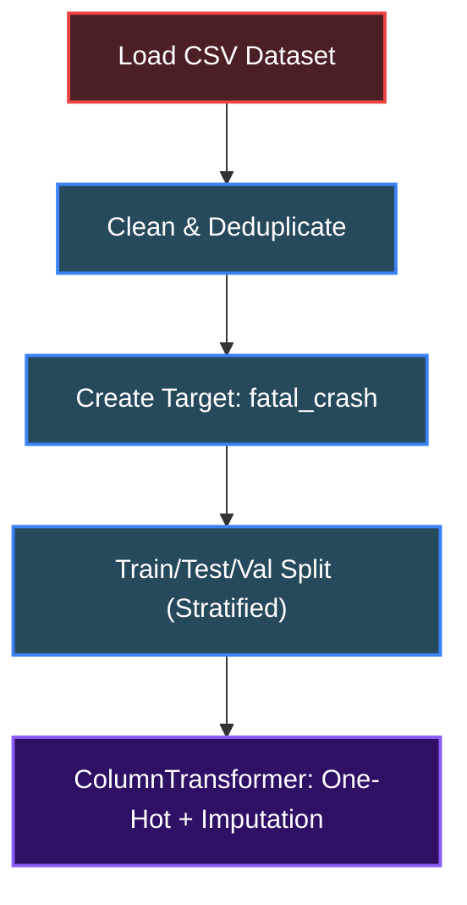
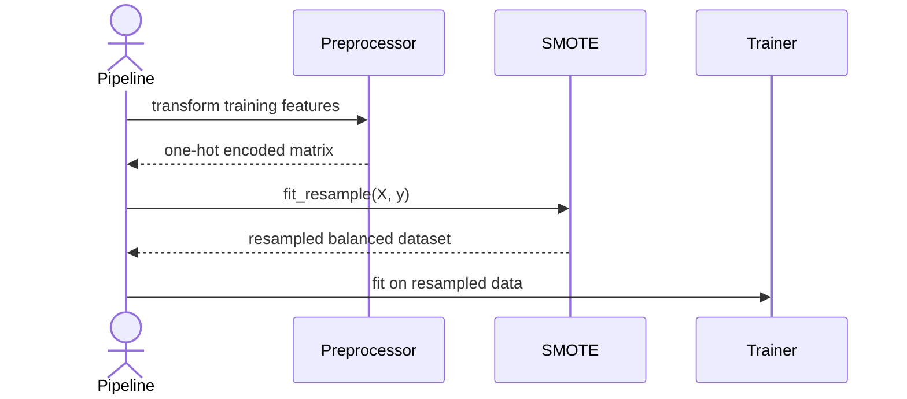

# Road Crash Fatality Prediction

When a traffic crash occurs, understanding what factors contribute to fatalities can help save lives. This project predicts whether a crash will be fatal using historical accident data, giving safety agencies the insights they need to pinpoint high-risk scenarios and allocate resources more effectively.

A machine learning pipeline built on Chicago traffic accident records. It tackles the extreme class imbalance between fatal and non-fatal crashes, trains multiple models, and picks the best one based on PR-AUC, the most relevant metric for rare-event prediction. The pipeline also visualizes exploratory patterns, ranks risk factors by importance, and saves everything you need to reuse the trained model.

## System Design


## Installation

1. Clone the repository:
   ```bash
   git clone git@github.com:skidev101/road-crash-prediction-model.git
   cd road-crash-prediction-model
   ```

2. Create and activate a virtual environment (recommended):
   ```bash
   python -m venv venv
   source venv/bin/activate  # Linux/macOS
   venv\Scripts\activate     # Windows
   ```

3. Install dependencies:
   ```bash
   pip install -r requirements.txt
   ```

4. Make sure the data file is placed at `data/traffic_accidents.csv` (the pipeline expects a CSV in that location).

## Usage

Run the entire pipeline with a single command:

```bash
python main.py
```

That's it. The script will:

- Load and clean the dataset
- Create the target variable (`fatal_crash`)
- Split the data into training, testing, and validation sets (70‑15‑15 split, stratified)
- Generate exploratory plots (target distribution, crash types, weather/lighting fatality rates, correlation heatmap)
- Train five models: Logistic Regression, Decision Tree, Random Forest, Gradient Boosting, and XGBoost
- Evaluate all models and select the best one based on PR‑AUC
- Output model comparison plots, confusion matrix, and feature importance

All results are saved under `outputs/`:

- `outputs/figures/` – all charts (PNG, 300 DPI)
- `outputs/metrics/` – CSV with model performance and feature importance
- `outputs/predictions/` – CSV with test-set predictions and probabilities

The best performing model is serialized to `models/best_fatality_model.pkl` and can be loaded later with:

```python
import joblib
model = joblib.load("models/best_fatality_model.pkl")
```

## Features

### Comprehensive data preprocessing

The pipeline handles missing values, creates a binary target from injury counts, removes duplicates, and separates 10 original categorical features from 5 numerical ones. It then builds a `ColumnTransformer` that one‑hot encodes categories and imputes missing numeric values with the median.



### Advanced handling of class imbalance (SMOTE)

Fatal crashes are extremely rare (less than 1% of records). To give the models a fighting chance, the pipeline applies SMOTE (Synthetic Minority Over‑sampling Technique) after preprocessing. This generates synthetic examples of the minority class, balancing the training set without simply duplicating original data.



### Multi-model training and PR‑AUC optimization

Five different classifiers are trained, including both linear and tree‑based models. Because accuracy is misleading with such a severe class imbalance, the pipeline selects the best model using Precision‑Recall AUC, a metric that focuses on the minority class and rewards models that can find true fatalities while limiting false alarms.


### Explainability: feature importance ranking

After the best model is chosen (typically the tree‑based ensemble that performed best on PR‑AUC), the pipeline extracts and plots the top risk factors. This tells you exactly which features drive the prediction, making the results actionable for traffic safety analysis.

## Technologies Used

| Technology           | Purpose                                      |
| -------------------- | -------------------------------------------- |
| Python               | Core programming language                    |
| NumPy                | Numerical computations                       |
| pandas               | Data manipulation and analysis               |
| scikit-learn         | Preprocessing, train/test split, base models |
| XGBoost              | Gradient boosting classifier                 |
| imbalanced‑learn     | SMOTE for class imbalance handling           |
| matplotlib / seaborn | Visualizations and exploratory analysis      |
| joblib               | Model serialization                          |

## Author

- GitHub: [https://github.com/skidev101](https://github.com/skidev101)

---

[](https://www.python.org/)
[](https://numpy.org/)
[](https://pandas.pydata.org/)
[](https://scikit-learn.org/)
[](https://xgboost.readthedocs.io/)
[](https://imbalanced-learn.org/)
